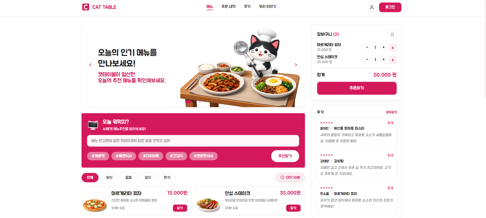
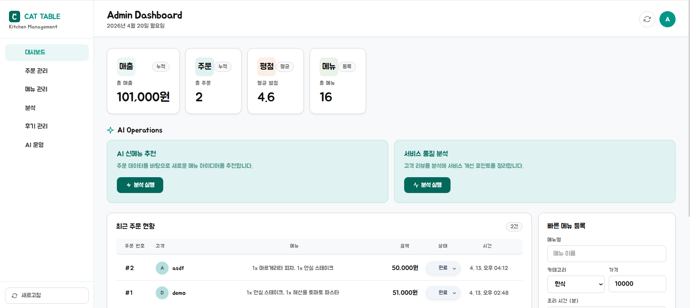

# CAT TABLE — 식당 MSA 프로젝트




고객용·관리자용 식당 서비스를 마이크로서비스 아키텍처(MSA)로 구현한 프로젝트입니다.  
**Docker Compose 명령어 하나**로 전체 서비스를 로컬에서 실행할 수 있습니다.

---

## 서비스 구조

```
┌─────────────────────────────────────────────────────────────────┐
│  고객 웹 (Vue3)        관리자 웹 (Vue3)                          │
│  localhost:5173        localhost:5174                            │
└──────────────┬───────────────────┬──────────────────────────────┘
               │                   │
               ▼                   ▼
      ┌─────────────────────────────────┐
      │   Gateway Service (Spring Boot) │  :8080
      │   · JWT 인증/권한 검사          │
      │   · 요청 라우팅                 │
      │   · Swagger UI (/swagger)       │
      └──┬──────┬──────┬──────┬────────┘
         │      │      │      │
    ┌────┘  ┌───┘  ┌───┘  ┌──┘
    ▼       ▼      ▼      ▼
  Auth   Menu   Order  Review   AI Services (FastAPI)
  :8081  :8082  :8083  :8084   :8001 / :8002 / :8003
  Redis  SQLite SQLite SQLite
```

---

## 실행 전 필요 사항

| 항목 | 버전 |
|------|------|
| Docker Desktop | 최신 버전 |
| Docker Compose | v2 이상 (`docker compose` 명령 지원) |

> **Node.js, Java, Python 별도 설치 불필요** — 모든 빌드가 Docker 내에서 진행됩니다.

---

## 빠른 시작

### 1. 저장소 클론

```bash
git clone https://github.com/05solar/OSS_project3.git
cd OSS_project3
```

### 2. 환경 변수 파일 생성

```bash
cp .env.example .env
```

`.env` 파일을 열어 값을 설정합니다.

```env
# JWT 서명 키 (임의의 긴 문자열로 변경 권장)
JWT_SECRET=my-secret-key-change-me

# OpenAI API 키 (AI 기능 사용 시 입력, 없어도 서비스 실행 가능)
OPENAI_API_KEY=

# 사용할 OpenAI 모델
OPENAI_MODEL=gpt-4o-mini
```

> `OPENAI_API_KEY`가 없거나 잘못되어도 AI 기능만 고정 응답으로 대체되며, 나머지 서비스는 정상 동작합니다.

### 3. 전체 서비스 빌드 및 실행

```bash
docker compose up --build
```

처음 실행 시 이미지 빌드에 수 분이 소요될 수 있습니다.  
`All services started` 메시지 이후 아래 주소로 접속하세요.

### 4. 백그라운드 실행

```bash
docker compose up -d --build
```

### 5. 종료

```bash
docker compose down
```

---

## 접속 주소

| 서비스 | 주소 |
|--------|------|
| 고객 웹 | http://localhost:5173 |
| 관리자 웹 | http://localhost:5174 |
| API 게이트웨이 | http://localhost:8080/api |
| Swagger API 문서 | http://localhost:8080/swagger |

---

## 기본 계정

| 구분 | 아이디 | 비밀번호 |
|------|--------|----------|
| 관리자 | `admin` | `admin1234` |
| 고객 | 고객 웹에서 직접 회원가입 | — |

---

## Swagger API 문서 사용법

1. http://localhost:8080/swagger 접속
2. 우측 상단 드롭다운에서 **"Gateway API"** 선택
3. **Authorize** 버튼 클릭 → 로그인으로 발급받은 `accessToken` 입력
4. 각 엔드포인트에서 **Try it out** → **Execute** 로 직접 테스트

---

## 프로젝트 구조

```
OSS_project3/
├── customer-web/          # 고객용 웹 (Vue 3 + Vite)
├── admin-web/             # 관리자용 웹 (Vue 3 + Vite)
├── services/
│   ├── gateway-service/   # API 게이트웨이 (Spring Boot)
│   ├── auth-service/      # 인증 서비스 (Spring Boot + Redis)
│   ├── menu-service/      # 메뉴 서비스 (Spring Boot + SQLite)
│   ├── order-service/     # 주문 서비스 (Spring Boot + SQLite)
│   └── review-service/    # 리뷰 서비스 (Spring Boot + SQLite)
├── ai-services/
│   ├── recommendation-service/  # 메뉴 추천 AI (FastAPI)
│   ├── review-writer-service/   # 리뷰 초안 작성 AI (FastAPI)
│   └── operations-ai-service/   # 운영 분석 AI (FastAPI)
├── docker-compose.yml     # 전체 서비스 오케스트레이션
├── .env.example           # 환경 변수 템플릿
└── README.md
```

---

## 주요 기능

### 고객 웹
- 카테고리·키워드 기반 메뉴 탐색
- 장바구니 → 주문
- 주문 내역 조회
- 리뷰 작성 (AI 초안 자동 생성 지원)
- AI 메뉴 추천
- 현재 혼잡도 AI 분석

### 관리자 웹
- 대시보드 (매출·주문·평점·메뉴 현황)
- 주문 목록 조회 및 상태 변경 (접수 → 조리 → 준비 → 완료)
- 리뷰 목록 조회 및 삭제
- 메뉴 등록·수정
- AI 신메뉴 제안
- AI 서비스 품질 평가

---

## 트러블슈팅

### 포트 충돌
다른 프로그램이 `5173`, `5174`, `8080~8084`, `6379` 포트를 사용 중이면 `docker-compose.yml`의 포트 매핑을 변경하세요.

### 빌드 캐시 초기화
```bash
docker compose down
docker compose build --no-cache
docker compose up
```

### 로그 확인
```bash
# 전체 로그
docker compose logs -f

# 특정 서비스 로그
docker compose logs -f gateway-service
```
